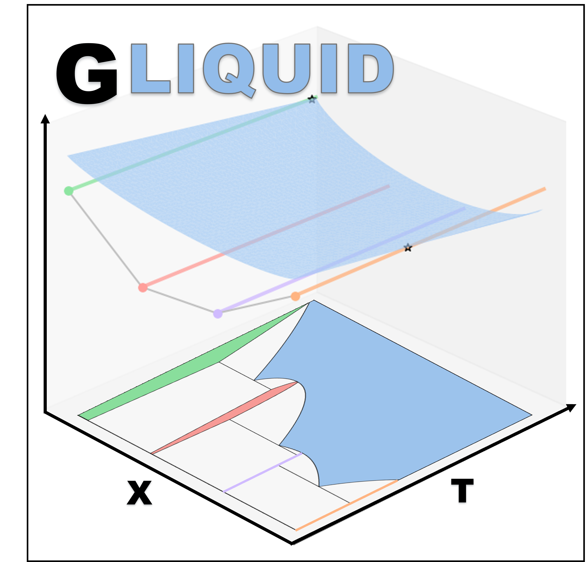

#  
# GLiquid: DFT-Referenced Thermodynamic Modeling

[](LICENSE)


## Overview
**GLiquid** is a Python-based tool designed for fitting **DFT-referenced liquid free energies** for the thermodynamic
modeling of two-component systems. It integrates **Jupyter notebooks**, interactive **Plotly visualizations**, and 
the **Materials Project API** to seamlessly fit and adjust non-ideal mixing parameters to describe the liquid phase. 
Future versions will support the use of fitted binary liquid free energies to interpolate multicomponent phase diagrams

## Installation & Setup
### **1. Clone the Repository**
Open your terminal and clone the repository to the folder where you want to store it locally. This step can also be 
done through downloading the zip file and unpacking it to your local directory
```bash
cd "some_local_directory"
git clone https://github.com/willwerj/gliquid_python.git
```

### **2. Create an Environment**
If you use a `conda` environment manager:
```bash
conda create --name gliquid-env python==3.10  # Python 3.11 & 3.12 also supported
conda activate gliquid-env
```
or if using `venv`:
```bash
# Linux Shell:
py -3.10 -m venv gliquid-env
source gliquid-env/bin/activate
```
      
```bash   
# Windows Powershell:                                                                
py -3.10 -m venv gliquid-env
Set-ExecutionPolicy -ExecutionPolicy RemoteSigned -Scope Process # As needed                                                
gliquid-env\Scripts\Activate.ps1      
```                       
                                                          
### **3. Install Dependencies**
Then, install the gliquid dependencies. For now, this is done locally 
```bash
# Pip package installation
pip install .
```

### **4. Get your API Key**
Visit the [Materials Project Website](https://next-gen.materialsproject.org/api) and create an account if you don't
already have one. You will need to log in to receive an API key, which you will then need to copy and paste into the 
first block of either jupyter notebook to use the Materials Project API.

## Usage
If using `jupyter`, you will first need to export your environment to the jupyter notebook kernel. Then, navigate 
to the [notebooks](notebooks) directory and run. If your IDE supports jupyter notebooks, 
configure and run in your IDE instead.

```bash
# Run these only if using jupyter to host notebooks
python -m ipykernel install --user --name=gliquid-env
cd notebooks
jupyter notebook
```

## Contributing

Pull requests are welcome. For major changes, please open an issue first
to discuss what you would like to change.

## License

[MIT](LICENSE)