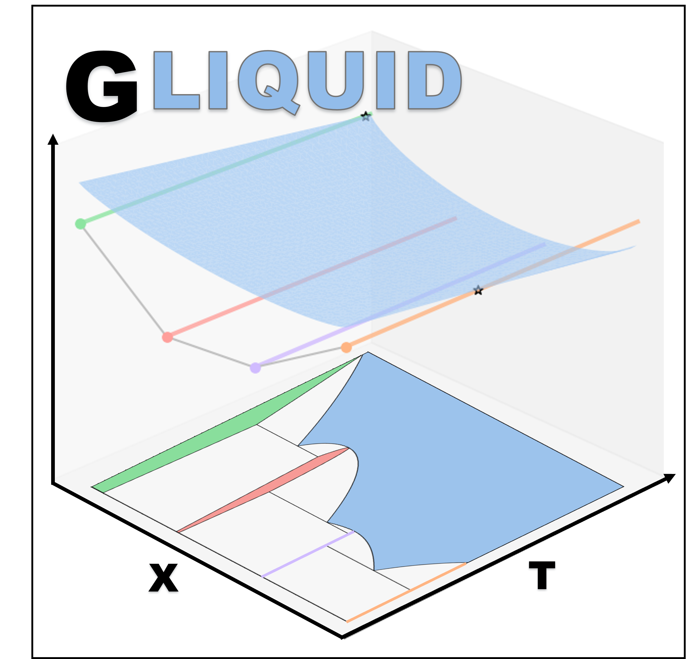

#  Thermodynamic Modeling for Binary Systems 

[](LICENSE)


## 📌 Overview
**G_Liquid** is a Python-based tool designed for fitting **DFT-referenced liquid free energies** for the thermodynamic
modeling of two-component systems. It integrates **Jupyter notebooks**, interactive **Plotly visualizations**, and 
the **Materials Project API** to seamlessly fit and adjust non-ideal mixing parameters to describe the liquid phase.

## 🚀 Installation & Setup
### **1. Clone the Repository**
```bash
git clone https://github.com/your-username/your-repo.git
cd your-repo
```

### **2. Create an Environment**
If you use a `conda` environment manager:
```bash
conda create --name gliquid-env python=3.9
conda activate gliquid-env
```
or if using `venv`:
```bash
python -m venv gliquid-env
source gliquid-env/bin/activate  # (Windows: venv\Scripts\activate)
```

### **3. Install Dependencies**
Then, install the dependencies listed in [requirements.txt](requirements.txt)
```bash
pip install -r requirements.txt
```

## 📊 Usage
Navigate to the [notebooks](notebooks) directory and run jupyter
```bash
cd notebooks
jupyter notebook
```

## 🤝 Contributing

Pull requests are welcome. For major changes, please open an issue first
to discuss what you would like to change.

Please make sure to update tests as appropriate.

## License

[MIT](LICENSE)